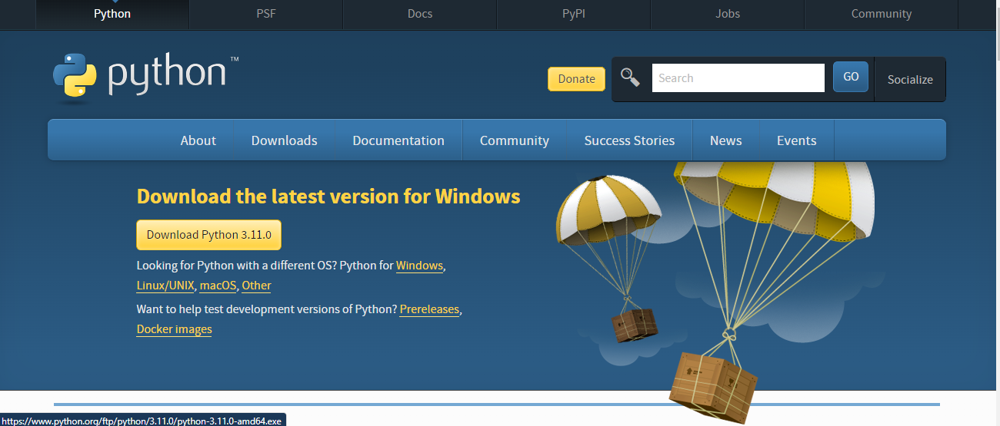
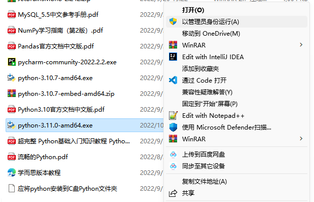
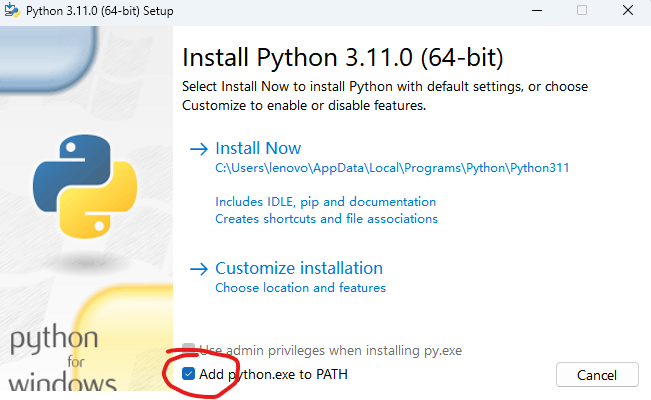
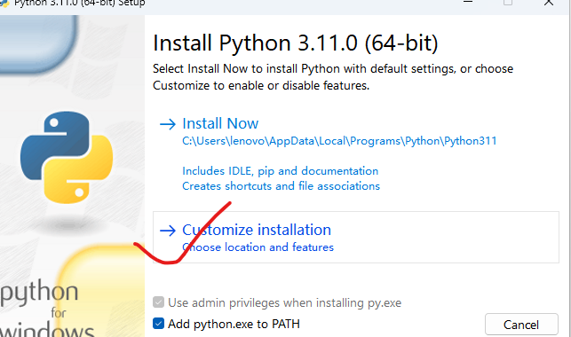
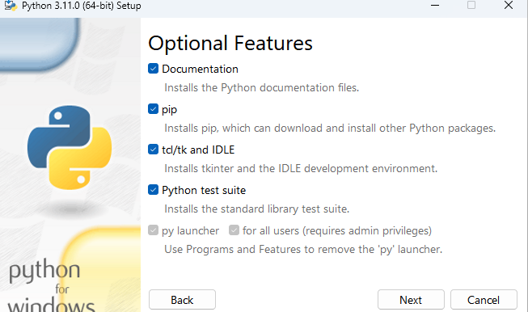
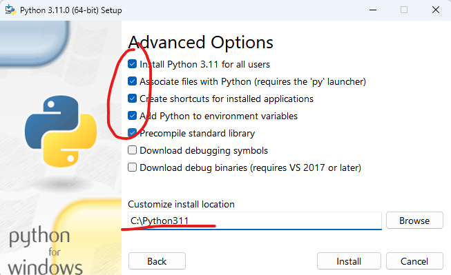
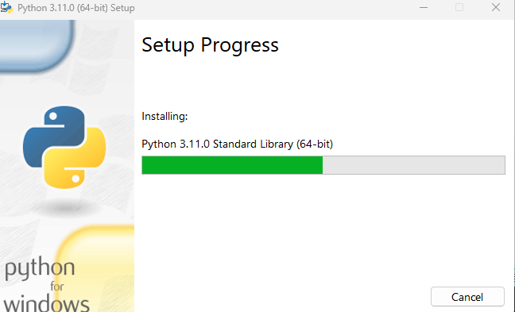

### 哈喽，大家好！今天我给大家带来的是Python IDE（集成开发环境） visual studio code的安装教程！
#### visual studio code是由微软公司开发的轻量级文本编辑器，能够解决99%的编程语言的编辑需求，结合插件，更是可以将Visual studio code改造为完美的IDE。
---
### 教程正式开始！
1. 本地安装Python解释器
   在使用visual studio code的过程中，我们需要本地解释器运行程序。
   1. 下载Python安装包   
      下载链接: <https://www.python.org/downloads>
      
      点击上图中的Download Python3.11即可

   2. 开始安装Python  
       
      右键以管理员方式运行 
       
      务必将python添加到PATH 
       
      点击Customize installation（自定义安装） 
       
      这一页，凡是能勾选的，全部勾选。然后点next 
       
      这里严格按照我的选项安装，下方Customize install location为Python的安装路径，建议不要安装在C盘和Program Files目录下。然后点install 
       
      这时已经在安装了 
       
      安装完成！ 

